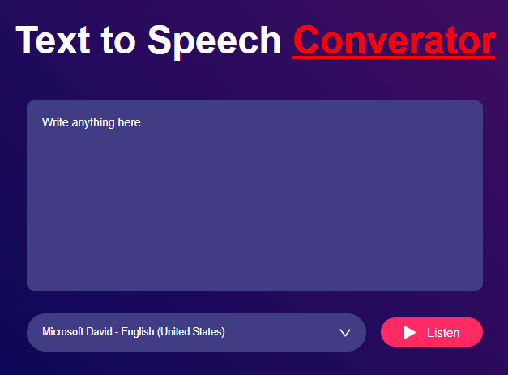

# Text-to-Speech-JS

In this example we learned how to implement text to speech application using the voices available in the system.

It uses following features:
1. SpeechSynthesisUtterance class to create speech object.
2. window.speechSynthesis.speak() to speak the text
3. window.speechSynthesis.getVoices(); to get all voices
4. new Option() will create new option for dropdox (select) item

Here's its screenshot
